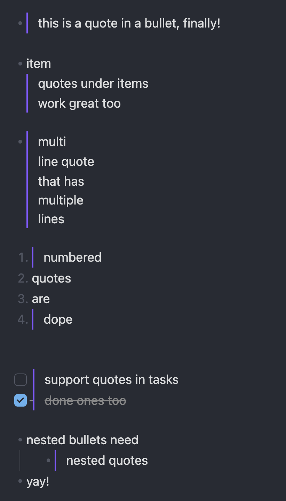

# Bullet Quote

Quotes inside bullets for [Obsidian](https://obsidian.md). Live Preview finally renders `- > quote` the way Reading view already does: a quote bar under the bullet, on every line of the quote.

<p align="center">
  
</p>

## Usage

Write a quote inside a bullet, numbered item, or task:

```md
- > this is a quote in a bullet, finally!
- item
  > quotes under items
  > work great too
- > multi
  > line quote
1. > numbered quotes
- [ ] > quotes in tasks
```

The `>` reappears while the cursor is on its line, so editing works as before. Reading view is untouched; Obsidian already parses these correctly there.

Why a plugin: Obsidian's Live Preview uses a line-based tokenizer that only opens a quote when `>` starts the line. CommonMark allows a quote to open right after a list marker, and Obsidian's Reading view honours that, so this only patches the editor.

## Install

Not yet in the community plugin list. Until then:

- **BRAT**: install [BRAT](https://github.com/TfTHacker/obsidian42-brat), then *Add beta plugin* with `geddski/obsidian-bullet-quote`.
- **Manual**: download `main.js`, `manifest.json` and `styles.css` from the [latest release](https://github.com/geddski/obsidian-bullet-quote/releases/latest) into `<vault>/.obsidian/plugins/bullet-quote/`, then enable it under *Community plugins*.

## Development

```
bun install
bun run dev      # watch build → main.js
bun run build    # typecheck + minified build
bun run lint
```

Symlink the repo into a vault's `.obsidian/plugins/bullet-quote` to run it live. With the [Hot Reload](https://github.com/pjeby/hot-reload) plugin installed, the `.hotreload` marker reloads the plugin on every rebuild.

Releases: bump with `npm version patch|minor|major`, then push the tag. The release workflow builds and attaches the artifacts.
